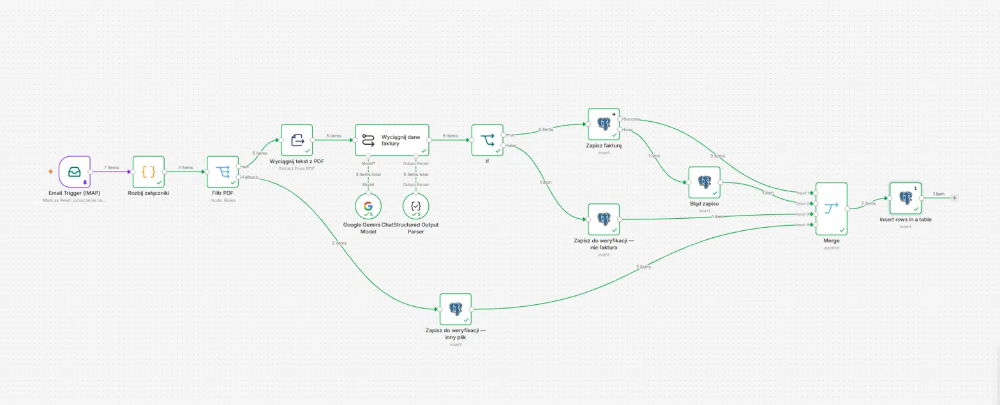
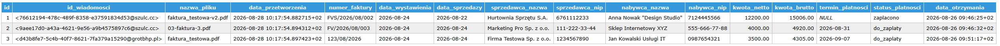
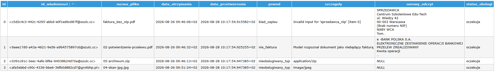
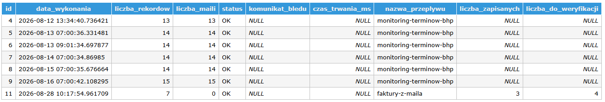

# faktury-z-maila

### Problem

Faktury przychodzą mailem jako załączniki PDF, a dane z nich trzeba ręcznie
przepisać do bazy.

- skrzynka wejściowa: osobny adres, nazwa nieoczywista, żeby nie trafiała
  na nią realna korespondencja

### Jak działa

- Email Trigger (IMAP, format Resolved, Fetch Only New Emails)
- Code „Rozbij załączniki" — jedna wiadomość → jeden item na załącznik
- Switch „Filtr PDF" po typie MIME, wyjścia: pdf / Fallback
- Extract from File → Basic LLM Chain (Google Gemini + Structured Output Parser)
- If na `czyFaktura` → zapis do `faktury` albo do `do_weryfikacji`
- Merge (append, 4 wejścia) → zapis wiersza do `logi_wykonan`

### Decyzje projektowe

Część rozwiązań w tym przepływie nie jest oczywista bez kontekstu, w jakim
powstała.

- jednostką przetwarzania jest dokument, nie wiadomość — rozbicie zaraz
  za triggerem, kolejne węzły nie muszą radzić sobie z tym, że raz dostają
  jeden załącznik, a raz dwa
- filtr po typie MIME, nie po rozszerzeniu nazwy pliku — rozszerzenie jest
  częścią nazwy, którą nadawca ustawia dowolnie
- przepływ nie porzuca dokumentu po cichu: trzy powody odrzucenia
  (nieobslugiwany_typ, nie_faktura, blad_zapisu), każdy z osobnym kontekstem
- Query Batching = Independent na węźle zapisu faktur — domyślnie insert
  idzie jedną operacją dla całej partii, jeden odrzucony wiersz cofa resztę
- do `logi_wykonan` dołożone kolumny (nazwa_przeplywu, liczba_zapisanych,
  liczba_do_weryfikacji) zamiast używania `liczba_maili` w innym znaczeniu
  niż w pierwszym przepływie
- status OK w logu mimo odrzuceń — odrzucenia są normalnym wynikiem
  przetwarzania, nie awarią przepływu
- `sprzedawca_nip` NOT NULL wynika z klucza UNIQUE (numer_faktury,
  sprzedawca_nip); wyłapywanie faktury bez NIP-u to skutek uboczny tej
  decyzji, nie zaprojektowana walidacja

### Obsługa błędów

- Error Workflow `alert-awarii` wspólny z pierwszym przepływem
  ([katalog](../alert-awarii/))
- link w mailu alertowym wymaga zmiennej `N8N_EDITOR_BASE_URL` w kontenerze;
  bez niej n8n wstawia localhost:5678 i alertu nie da się otworzyć z telefonu
- logowanie każdego wykonania do `logi_wykonan`
- poświadczenia wyłącznie w Credentials

### Znane ograniczenia

- Mark as Read oznacza wiadomość przy pobraniu, nie po sukcesie przepływu —
  mail utracony w dalszej części nie wróci przy kolejnym uruchomieniu,
  dlatego `do_weryfikacji` jest warunkiem poprawności, nie udogodnieniem
- brak retry na węźle AI i na węzłach Postgres
- `czas_trwania_ms` w logu nie jest wypełniany
- rozpoznanie dokumentu opiera się na modelu językowym i wymaga weryfikacji
  człowieka przy dokumentach nietypowych

### Test

- 7 załączników wejściowych → 5 PDF + 2 odrzucone na typie
- 5 przetworzonych przez model → 4 rozpoznane jako faktura, 1 odrzucona
- wynik: 3 wiersze w `faktury`, 4 w `do_weryfikacji`, 1 w `logi_wykonan`
