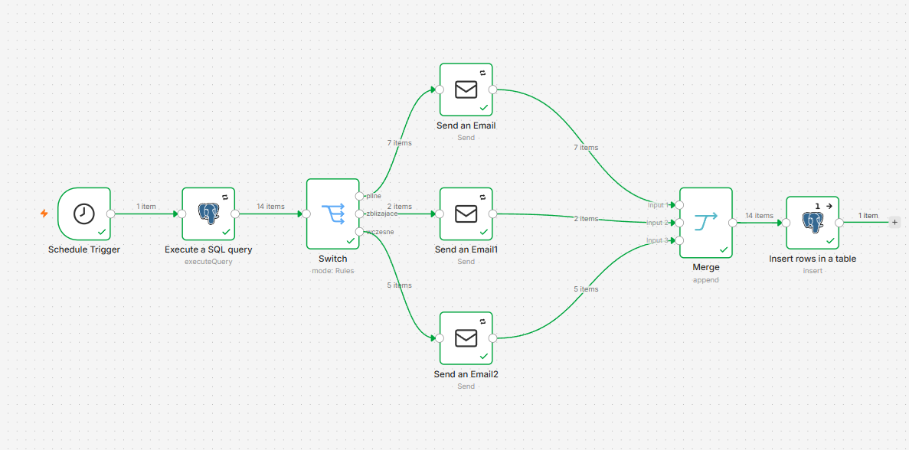
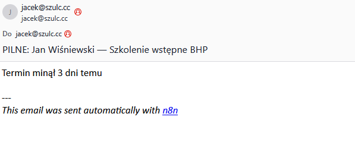
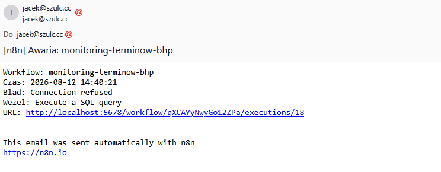

# monitoring-terminow-bhp

### Problem

Terminy szkoleń BHP i badań lekarskich pilnowane ręcznie w arkuszu. Przeoczony termin
oznacza pracownika bez ważnych uprawnień i ryzyko kary przy kontroli PIP. Przy
kilkudziesięciu pracownikach przegląd arkusza to zadanie, o którym łatwo zapomnieć.

### Jak działa

1. Schedule Trigger, codziennie o 7:00
2. Postgres (Execute Query), pobiera rekordy z okna od -30 do +30 dni względem dzisiejszej
   daty i wylicza `dni_do_wygasniecia` po stronie bazy
3. Switch, trzy progi: do 7 dni (pilne), do 14 (zbliżające), do 30 (wczesne)
4. Trzy węzły Send Email, osobna treść i temat dla każdego poziomu pilności, adresat
   czytany z bazy przez `{{ $json.email_przelozonego }}`
5. Merge w trybie Append z trzema wejściami, łączy gałęzie w jeden strumień
6. Postgres (Insert), jeden wiersz do `logi_wykonan` na każde uruchomienie

*Cały przepływ: trigger, zapytanie, Switch z trzema wyjściami, trzy węzły mailowe,
Merge i zapis do logu.*

### Decyzje projektowe

- Zapytanie ogranicza wyniki do okna od -30 do +30 dni. Rekord przeterminowany o kilka
  dni nadal wymaga reakcji, więc trafia do powiadomień. Rekord przeterminowany o rok to
  martwa dana do wyczyszczenia w bazie, a nie powód do codziennego maila.
- Switch działa w trybie pierwszego dopasowania, dlatego progi są ułożone od
  najostrzejszego. Rekord z 3 dniami pasuje do wszystkich trzech reguł, ale trafia
  wyłącznie do gałęzi `pilne`.
- Terminy przeterminowane (ujemna liczba dni) trafiają do gałęzi `pilne` i mają osobną
  treść: "Termin minął X dni temu" zamiast "-X dni".
- Węzeł Insert ma Execute Once, ale samo to nie wystarczyło. Trzy gałęzie wpięte w jeden
  węzeł uruchamiały go trzykrotnie i dawały 3 wiersze zamiast jednego. Rozwiązałem to
  węzłem Merge w trybie Append.
- Insert ma On Error: Continue. Błąd zapisu do logu nie wywraca przepływu, bo procesem
  jest wysyłka powiadomień, a nie logowanie.
- `status` jest zapisywany jako 'OK'. Jeśli przepływ się wywróci, w ogóle nie dojdzie do
  węzła Insert. Od alertowania jest osobny workflow.
- Retry On Fail (3 próby, 5 sekund odstępu) na węzłach sięgających na zewnątrz: Postgres
  i trzy węzły SMTP. Awarie sieciowe są chwilowe.
- Wszystkie poświadczenia w Credentials n8n, zero haseł w węzłach.

*Powiadomienie z gałęzi `pilne`. Temat i treść różnią się między poziomami pilności.*

### Znane ograniczenia

- Link w mailu alertowym prowadzi na localhost:5678. Do naprawy przez zmienną
  środowiskową `N8N_EDITOR_BASE_URL`.

Przepływ działa na danych testowych. To projekt własny, nie wdrożenie u klienta.

## alert-awarii

Osobny workflow z węzłem Error Trigger, podpięty w ustawieniach przepływu głównego
(Settings, Error Workflow). Wysyła maila z nazwą przepływu, treścią błędu, nazwą węzła
i linkiem do wykonania.

Error Workflow nie uruchamia się przy ręcznym wykonaniu przepływu, tylko przy
produkcyjnym (harmonogram, webhook). Ma to znaczenie przy testowaniu. Sprawdziłem go na
wywołanej awarii: zmieniony port Postgresa, uruchomienie z harmonogramu, mail
z komunikatem "Connection refused".

*Alert z workflow `alert-awarii`: nazwa przepływu, węzeł, na którym wystąpił błąd,
i treść komunikatu.*

## Uruchomienie

1. Utworzyć bazę według `monitoring-terminow-bhp/schema.sql`
2. Zaimportować `workflow.json` obu przepływów do n8n
3. Skonfigurować dwa poświadczenia: Postgres i SMTP
4. Podpiąć `alert-awarii` w ustawieniach przepływu głównego (Settings, Error Workflow)
5. Opublikować przepływ, inaczej harmonogram nie ruszy

## Środowisko

n8n w kontenerze Docker na własnym serwerze (Unraid). PostgreSQL w osobnym kontenerze.
